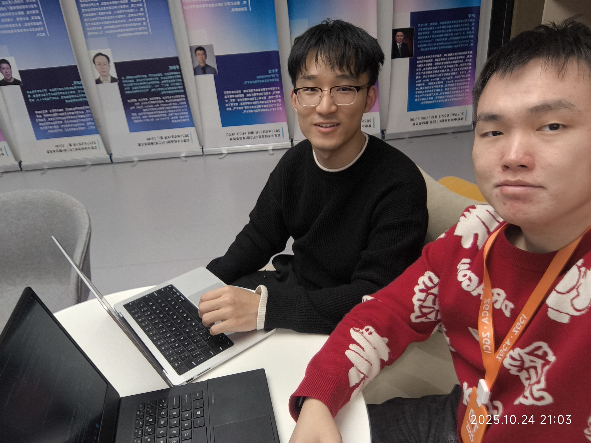

## 作业要求

**博客链接**: [现代软件工程课程作业](https://jiaju-chen.github.io/SoftwareEngineering/2025-10-25-elevator.html)  
**项目地址**: [https://github.com/Jiaju-Chen/SoftwareEngineering](https://github.com/Jiaju-Chen/SoftwareEngineering)

## 项目概述

基于 Elevator Saga 的电梯调度系统实现，通过多策略优化算法专注于最小化乘客等待时间。项目包含完整的后端算法、前端可视化界面和性能监控系统。

---

## PSP表格

### 预估时间

| 阶段 | 预估时间 |
|------|----------|
| 需求分析 | 0.5h |
| 看代码架构 | 2h |
| 算法设计 | 1h |
| 编码实现 | 4h |
| 测试调试 | 1h |
| 总结展示 | 2h |

### 实际时间

| 阶段 | 实际时间 | 差异原因 |
|------|----------|----------|
| 需求分析 | 0.5h | 符合预期 |
| 看代码架构 | 2h | 符合预期 |
| 算法设计 | 1.5h | 算法优化比预期复杂 |
| 编码实现 | 6h | 调试时间超出预期 |
| 测试调试 | 2h | 环境配置和问题排查 |
| 合并讨论 | 2h | 代码合并和问题讨论 |
| 助教端调试 | 2h | 环境配置和调试 |
| 写说明文档 | 1h | 文档编写 |

---

## 问题回答

### 1. 重要模块接口设计与实现

**核心算法**：智能范围巡回算法
- **关键思想**：不去最高与最低的楼层，而是检测当前所有用户的所在楼层和目的地范围，在这个范围内巡回
- **独到之处**：当没有用户请求且没有用户在电梯中时，电梯原地等待，避免无意义的空跑
- **算法优势**：减少了巡回距离，降低了无用能耗
- **算法劣势**：没有考虑跳过没有用户的楼层，可能错过潜在的效率提升

**算法表现分析**：
- **优势原因**：智能范围检测、原地待命机制、动态调整策略
- **劣势原因**：预测能力不足、全局优化有限、复杂场景处理能力弱

---

### 2. 代码重构与版本控制

**需求变化时的重构策略**：
1. **初期问题**：代码结构过于复杂，多个功能耦合在一起
2. **重构方案**：简化代码架构，一个文件搞定一个功能
3. **重构原则**：单一职责，模块解耦，接口标准化

**回归测试保证**：
- 建立自动化测试套件
- 每次修改后运行完整测试
- 使用性能基准确保算法效果不退化
- 通过GUI界面实时验证功能正确性

**Git协作与问题解决**：
- **合并策略**：简单修改手动合并，复杂功能Pull Request合并
- **遇到的问题**：电梯停的过早，通过GUI界面发现问题，结合代码分析定位原因
- **提交统计**：总共提交了29次代码

---

### 3. Information Hiding, Interface Design, Loose Coupling

在结对编程中，我们充分利用了这些软件工程原则：

**Information Hiding（信息隐藏）**：
- 将电梯状态、乘客信息等内部数据封装在类中
- API客户端隐藏了网络通信的复杂性
- 算法实现细节对调用者透明

**Interface Design（接口设计）**：
- 定义了清晰的ElevatorController抽象基类
- 统一的回调接口（on_passenger_call, on_elevator_idle等）
- 标准化的数据模型（ProxyElevator, ProxyFloor等）

**Loose Coupling（松耦合）**：
- 算法模块与系统事件解耦
- 前端界面通过API与后端通信
- 模块间通过接口而非具体实现交互

---

### 4. 代码规范与异常处理

**代码规范**：
- 采用Python PEP8编码规范
- 统一的命名约定
- 详细的注释和文档字符串
- 通过代码审查确保质量

**异常处理**：
- 网络连接失败时的重试机制
- 服务器超时的优雅降级
- 数据验证和边界检查

---

### 5. 界面模块设计

**用户界面设计**：
- **前端技术栈**：Vue.js + TypeScript + Vite
- **组件化设计**：电梯可视化、控制面板、性能指标
- **实时更新**：WebSocket连接实现状态同步

**界面功能**：
1. **电梯状态可视化**：实时显示电梯位置、方向、载客情况
2. **性能监控面板**：显示等待时间、能耗、完成率等关键指标
3. **控制面板**：支持手动干预和参数调整
4. **日志系统**：记录系统运行状态和异常信息

**MVC设计模式体现**：
- **Model（模型）**：
  - `ElevatorBusExampleController`：业务逻辑模型，处理电梯调度算法
  - `ProxyElevator/ProxyFloor/ProxyPassenger`：数据模型，封装电梯、楼层、乘客状态
  - `useElevatorSimulation`：数据管理模型，负责与后端API通信和状态同步
- **View（视图）**：
  - `App.vue`：主应用视图，协调各组件
  - `ElevatorView.vue`：电梯可视化组件
  - `MetricsPanel.vue`：性能指标展示组件
  - `ElevatorCar.vue`：单个电梯车厢组件
  - `ControlBar.vue`：控制面板组件
  - `FloorQueueBadge.vue`：楼层队列标识组件
- **Controller（控制器）**：
  - `elevatorApi.ts`：API服务控制器，处理HTTP请求
  - Vue组件的事件处理器：响应用户交互
  - `useElevatorSimulation`：状态管理控制器，协调数据流

**模块对接**：
- 前端通过HTTP API与后端实时通信
- 界面组件通过Vue的响应式系统进行状态同步
- 数据流：API → Controller → Model → View

---

### 6. 结对编程实践

**采用的合作方式**：
- **Driver-Navigator模式**：一人编写代码，一人审查和指导
- **并行开发**：各自负责不同模块，定期同步
- **代码审查**：所有代码都经过双方审查

**结对编程优点**：
1. **结合各自所长**：发挥不同技能优势
2. **分工讨论**：激发新的想法和解决方案
3. **质量保证**：双重检查减少bug
4. **知识共享**：相互学习提升技能

**结对编程缺点**：
1. **沟通成本**：需要更多时间进行讨论
2. **进度较慢**：相比单人开发效率略低
3. **协调困难**：需要良好的沟通和配合

**伙伴评价**：
- **优点**：执行力强、代码能力强、学习能力、责任心强
- **缺点**：有点忙，时间安排紧张

**改进建议（三明治方法）**：
1. **肯定优点**：首先肯定伙伴的技术能力和执行力
2. **指出问题**：温和地指出时间管理的问题
3. **提供建议**：建议制定更合理的时间计划，提前安排项目时间
4. **鼓励支持**：表达对伙伴能力的信任，相信能够改进

---

### 7. 结对编程照片

*上图展示了我们在结对编程过程中的讨论场景，通过实时协作解决技术问题*

---

### 8. 结对编程理论学习

**合作方式**：
- **Driver-Navigator模式**：一人编写代码，一人审查和指导
- **并行开发**：各自负责不同模块，定期同步
- **代码审查**：所有代码都经过双方审查

**结对编程优点**：
1. **结合各自所长**：发挥不同技能优势
2. **分工讨论**：激发新的想法和解决方案
3. **质量保证**：双重检查减少bug
4. **知识共享**：相互学习提升技能

**结对编程缺点**：
1. **沟通成本**：需要更多时间进行讨论
2. **进度较慢**：相比单人开发效率略低
3. **协调困难**：需要良好的沟通和配合

---

### 9. PSP表格实际时间

**实际开发时间记录**：
- 需求分析：0.5h（符合预期）
- 看代码架构：2h（符合预期）
- 算法设计：1.5h（算法优化比预期复杂）
- 编码实现：6h（调试时间超出预期）
- 测试调试：2h（环境配置和问题排查）
- 合并讨论：2h（代码合并和问题讨论）
- 助教端调试：2h（环境配置和调试）
- 写说明文档：1h（文档编写）

**差异原因**：
- 算法调试比预期复杂，需要更多时间优化
- 环境配置和问题排查花费了额外时间
- 代码合并和讨论需要协调时间

### 10. 其他收获

**AI工具协作经验**：
- **初期问题**：完全让AI去写代码，发现AI能力不足，效果差
- **改进策略**：理清脉络，让AI执行具体的操作，人工负责架构设计和关键逻辑，AI负责代码实现和细节优化
- **效果提升**：显著提升开发效率

**技术探索与学习**：
- **阅读资料**：《现代软件工程》相关章节、Elevator Saga官方文档、Vue.js和TypeScript技术文档、算法优化相关论文
- **技术难点攻克**：实时通信、状态同步、性能优化、异常处理

**算法优劣分析**：
- **算法优势**：减少巡回距离、降低无用能耗、智能范围检测、实时响应
- **算法劣势**：预测能力不足、全局优化有限、楼层跳过、复杂场景处理能力弱
- **改进方向**：引入机器学习预测用户行为、实现全局优化算法、增加楼层跳过策略、优化复杂场景处理逻辑

---

## 经验总结

### 成功要素
1. **算法选择**: 根据场景特点选择合适策略
2. **系统设计**: 模块化架构便于维护和扩展
3. **性能监控**: 实时指标帮助优化决策
4. **自动化**: 减少手动操作，提升开发效率
5. **结对编程**: 通过协作提升代码质量和学习效果

### 改进方向
1. **机器学习**: 引入历史数据训练更智能的调度策略
2. **预测算法**: 基于流量模式预测未来请求
3. **多目标优化**: 同时优化等待时间、能耗和用户体验
4. **分布式架构**: 支持大规模电梯网络

---

## 技术栈总结

- **后端**: Python, Elevator Saga API, Quart, Hypercorn
- **前端**: Vue.js, TypeScript, Vite
- **工具**: npm, pip, curl
- **部署**: Bash脚本, 进程管理
- **监控**: 性能指标, 实时日志
- **版本控制**: Git, GitHub

这个项目展示了从算法设计到系统实现的完整软件工程实践，体现了模块化设计、性能优化、结对编程和自动化部署等现代软件开发的最佳实践。通过这次项目，我们不仅掌握了电梯调度算法的设计，更重要的是学会了如何在实际项目中应用软件工程原则，进行有效的团队协作和代码管理。
