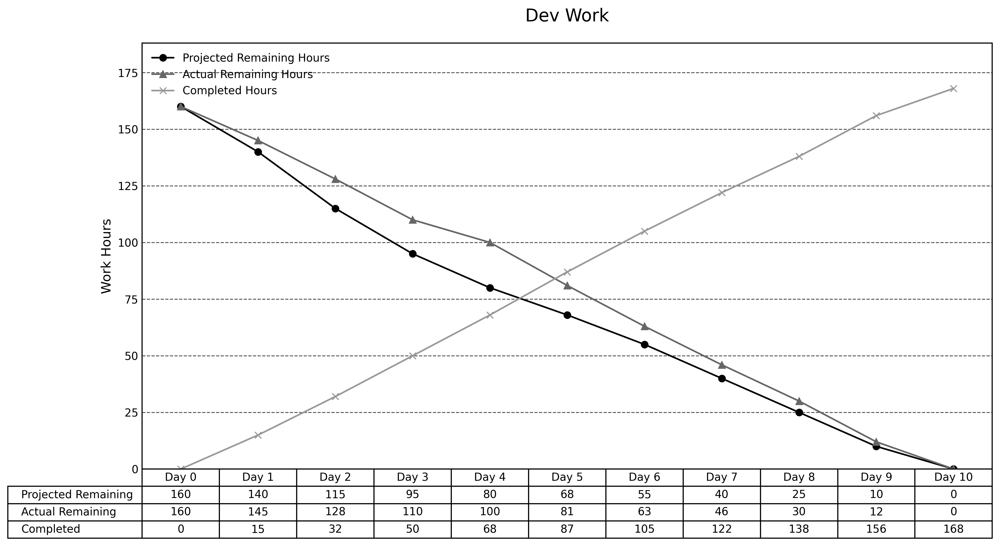

> **项目地址**：[`NewsMind` 项目代码仓库](https://z.gitee.cn/zgca/NewsMind/tree/develop)

## 🧭 项目核心信息
- [《团队博客1 - 团队项目核心信息》](/SoftwareEngineering/团队博客1-团队项目核心信息.html)
- [《团队博客2 - 项目Alpha阶段的计划和估计》](/SoftwareEngineering/groupblog2.html)

## 📅 今日小结
Alpha 版本功能冻结并成功部署，团队完成回顾与演示。

## 🔄 今日进度
### 陈家驹
- **我自从上次 Scrum 后的工作进展**：编写并执行部署脚本，Alpha 版本已上线测试环境。
- **我碰到的困难**：服务器镜像缺少最新 Node 版本，手动加装后解决。
- **我今天要完成的工作**：整理发布公告与回顾笔记。

### 姜厚丞
- **我自从上次 Scrum 后的工作进展**：完成最后的性能 profiling，并把日志切到结构化输出。
- **我碰到的困难**：发现一处缓存穿透的边界 case，已通过批量预热解决。
- **我今天要完成的工作**：准备 Beta 阶段的 backlog。

### 方羿
- **我自从上次 Scrum 后的工作进展**：整理 UI handoff 文档并录制演示视频。
- **我碰到的困难**：录屏时浏览器通知弹窗干扰，只能切换到专用账号。
- **我今天要完成的工作**：收集团队反馈并更新设计系统。

### 宋尚文
- **我自从上次 Scrum 后的工作进展**：完成 LLM 结果缓存策略，减少重复调用 42%，并协助 QA 回归。
- **我碰到的困难**：缓存命中率在新闻突发时下降，需要加入 TTL 分级策略。
- **我今天要完成的工作**：撰写 Alpha 回顾与性能分析。

## 📋 任务追踪

| 任务ID | 描述 | 最初计划 (h) | 已耗时 (h) | 剩余 (h) |
| :-- | :-- | --: | --: | --: |
| PM-06 | 部署脚本与执行 | 4 | 4 | 0 |
| AI-10 | LLM 缓存优化 | 4 | 4 | 0 |
| PM-10 | 团队博客整理 | 4 | 4 | 0 |
| FE-10 | 响应式设计回归 | 4 | 4 | 0 |

## 📉 燃尽图与数据

| 指标 | 小时 |
| :-- | --: |
| 今日完成 (Completed Hour) | 12 |
| 累计完成 (Cumulative Completed Hour) | 168 |
| 实际剩余 (Actual Remaining Hour) | 0 |
| 预估剩余 (Original Estimated Remaining Hour) | 0 |

