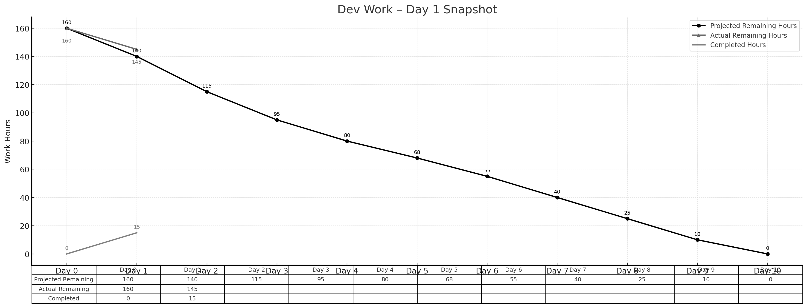

> **项目地址**：[`NewsMind` 项目代码仓库](https://z.gitee.cn/zgca/NewsMind.git)

## 🧭 项目核心信息
- [《团队博客1 - 团队项目核心信息》](/SoftwareEngineering/团队博客1-团队项目核心信息.html)
- [《团队博客2 - 项目Alpha阶段的计划和估计》](/SoftwareEngineering/groupblog2.html)
- [《团队博客3 - Alpha阶段的发布》](/SoftwareEngineering/团队博客3：alpha阶段的发布.html)
- [《团队博客4 - Alpha阶段的 Postmortem 会议》](/SoftwareEngineering/团队博客4：alpha阶段的 postmortem 会议.html)
- [《团队博客5 - Beta阶段的计划与估计》](/SoftwareEngineering/团队博客5.html)

# **Beta Sprint — Day 1 Daily Scrum**

## 📅 概览
Beta Sprint 第一天顺利完成。今天主要目标是完成环境初始化、核心架构搭建，以及几项关键基础功能的准备工作。  
整体进度略微落后于理想计划，但在可接受范围内。

> **今日完成工时：15h**  
> **理想剩余：140h**  
> **实际剩余：145h**

---

## 👥 今日工作概述

### **姜厚丞（后端） — 3h**
- 开始 MongoDB → SQLite 数据迁移（BE-11）
- 完成用户表、偏好表、新闻源表等核心表的初版结构设计

### **方羿（前端） — 4h**
- 完成 Beta 版前端项目初始化（FE-11）
- 搭建基础路由、全局样式与通用组件结构

### **林伟权（AI/搜索） — 4h**
- 搭建 Key Search 倒排索引基础结构（AI-11）
- 完成简单的文本预处理流程（分词、停用词过滤）

### **陈家驹（PM/DevOps） — 4h**
- 搭建 Beta 开发看板（PM-12）
- 更新 CI/CD 工作流：增加构建检查与基础 Lint 流程

> 注：有 1 小时为多人协作与沟通时间，计入总完成工时 15h。

---

## 📌 任务状态简表

| 任务 ID | 预计工时 | 已花费 | 剩余 | 状态   |
|--------|----------|--------|------|--------|
| BE-11  | 4h       | 3h     | 1h   | 进行中 |
| FE-11  | 4h       | 4h     | 0h   | ✔ 完成 |
| AI-11  | 4h       | 4h     | 0h   | ✔ 完成 |
| PM-12  | 4h       | 4h     | 0h   | ✔ 完成 |

---

## 🔥 今日小结

- ✅ 架构与环境均已搭建完成，团队进入正常开发节奏  
- ✅ 搜索、前端、后端、DevOps 四条线都已"开张"  
- ⚠ 实际剩余工时 145h，略高于理想的 140h，后续两天需要稍微追一下进度  

---

## 📊 Day 1 燃尽图

---

## 📈 燃尽情况

- **理想剩余：140h**  
- **实际剩余：145h**  
- **累计完成：15h**  

