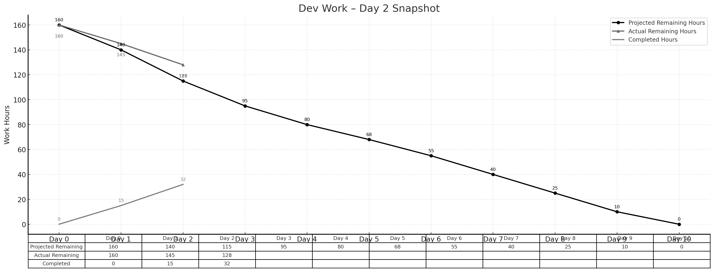

> **项目地址**：[`NewsMind` 项目代码仓库](https://z.gitee.cn/zgca/NewsMind.git)

## 🧭 项目核心信息
- [《团队博客1 - 团队项目核心信息》](/SoftwareEngineering/团队博客1-团队项目核心信息.html)
- [《团队博客2 - 项目Alpha阶段的计划和估计》](/SoftwareEngineering/groupblog2.html)
- [《团队博客3 - Alpha阶段的发布》](/SoftwareEngineering/团队博客3：alpha阶段的发布.html)
- [《团队博客4 - Alpha阶段的 Postmortem 会议》](/SoftwareEngineering/团队博客4：alpha阶段的 postmortem 会议.html)
- [《团队博客5 - Beta阶段的计划与估计》](/SoftwareEngineering/团队博客5.html)

# **Beta Sprint — Day 2 Daily Scrum**

## 📅 概览
Day 2 进入正式功能开发阶段，前端开始制作用户注册 UI，后端完成 SQLite 主要表结构，AI 侧实现向量检索接口。整体进度相比理想计划略微落后。

> **今日完成工时：17h**  
> **理想剩余：115h**  
> **实际剩余：128h**（略微落后）

---

## 👥 今日工作概述

### **姜厚丞（后端） — 4h**
- 完成 SQLite 核心表结构（BE-11 收尾）
- 确认用户、偏好、新闻源、新闻内容等表的字段设计
- 与前端、AI 对齐字段命名规范

### **方羿（前端） — 4h**
- 完成新版首页基础布局（FE-11 完成）
- 开始实现用户注册 UI（FE-12）
- 搭建表单组件和基础交互逻辑

### **林伟权（AI/搜索） — 4h**
- 完成向量检索接口封装（AI-12）
- 编写向量化文本的简单测试脚本
- 规划 Key Search + Vector 检索的组合流程

### **陈家驹（PM/DevOps） — 4h**
- 完成接口冻结文档初稿（PM-15）
- 维护 Beta 看板、梳理任务优先级
- 尝试跑通一次基础 UT 流程

> 约 1 小时团队沟通时间，合计当天 **17h**。

---

## 📌 任务状态简表

| 任务 ID | 预计工时 | 已花费 | 剩余 | 状态   |
|--------|----------|--------|------|--------|
| BE-11  | 4h       | 4h     | 0h   | ✔ 完成 |
| FE-12  | 4h       | 2h     | 2h   | 进行中 |
| AI-12  | 4h       | 4h     | 0h   | ✔ 完成 |
| PM-15  | 4h       | 4h     | 0h   | ✔ 完成 |

---

## 🔥 今日小结

- ✅ 向量检索接口已经可用，为后续推荐与 QA 提供基础  
- ✅ 前后端接口命名、字段设计基本统一  
- ⚠ 实际剩余工时为 **128h**，高于理想的 **115h**，说明前两天稍微偏慢，后续需要提效

---

## 📊 Day 2 燃尽图

---

## 📈 燃尽情况

- **理想剩余：115h**  
- **实际剩余：128h**  
- **累计完成：32h**  

