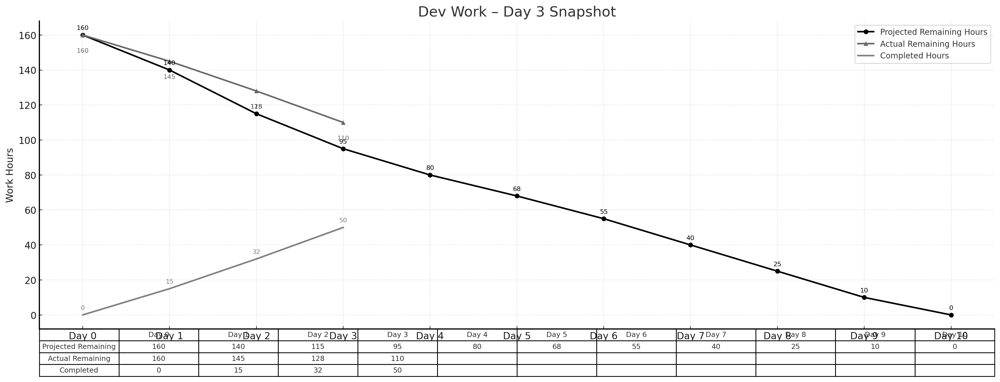

> **项目地址**：[`NewsMind` 项目代码仓库](https://z.gitee.cn/zgca/NewsMind.git)

## 🧭 项目核心信息
- [《团队博客1 - 团队项目核心信息》](/SoftwareEngineering/团队博客1-团队项目核心信息.html)
- [《团队博客2 - 项目Alpha阶段的计划和估计》](/SoftwareEngineering/groupblog2.html)
- [《团队博客3 - Alpha阶段的发布》](/SoftwareEngineering/团队博客3：alpha阶段的发布.html)
- [《团队博客4 - Alpha阶段的 Postmortem 会议》](/SoftwareEngineering/团队博客4：alpha阶段的 postmortem 会议.html)
- [《团队博客5 - Beta阶段的计划与估计》](/SoftwareEngineering/团队博客5.html)

# **Beta Sprint — Day 3 Daily Scrum**

## 📅 **概览**

Day 3 进入核心功能推进阶段，以搜索功能、多阶段检索架构以及偏好设置的 UI 完成为主。整体节奏**略落后于计划**，但差距已在缩小。

> **今日完成工时：18h**
> **理想剩余：95h**
> **实际剩余：110h**

---

## 👥 **今日工作概述**

### **姜厚丞（后端） — 4h**

* 完成新闻源管理 API（BE-13）
* 增加来源合法性检查逻辑（URL 格式、标签校验）
* 与前端、AI 对齐新闻源字段和结构

### **方羿（前端） — 5h**

* 完成注册页面（FE-12 收尾）
* 开始偏好设置页面开发（FE-13）
* 实现"新闻源选择 / 主题偏好"的表单交互

### **林伟权（AI/搜索） — 5h**

* 实现 Key + Vector 两阶段检索（AI-13）
* 完成第一版 rerank 规则（关键词覆盖度）
* 设计 QA 模式使用的文本切片策略

### **陈家驹（PM/DevOps） — 4h**

* 进行一次接口小联调（注册 → 偏好 → 推荐）
* 跑通基础 UT 流程并记录问题

> 合计开发与沟通时长：**18h**（累计完成工时达 50h）。

---

## 📌 **任务状态简表**

| 任务 ID | 预计工时 | 已花费 | 剩余 | 状态   |
| ----- | ---- | --- | -- | ---- |
| BE-13 | 4h   | 4h  | 0h | ✔ 完成 |
| FE-13 | 4h   | 3h  | 1h | 进行中  |
| AI-13 | 4h   | 4h  | 0h | ✔ 完成 |

---

## 🔥 **今日小结**

* ✓ 多阶段检索框架成功跑通，是推荐效果提升的重要节点
* ✓ 偏好设置 UI 主逻辑已构建完成
* ⚠ 实际剩余仍高于理想（110h vs 95h），后续两天需提高推进速度

---

## 📊 **Day 3 燃尽图**

---

## 📈 **燃尽情况**

* **理想剩余：95h**
* **实际剩余：110h**
* **累计完成：50h**

