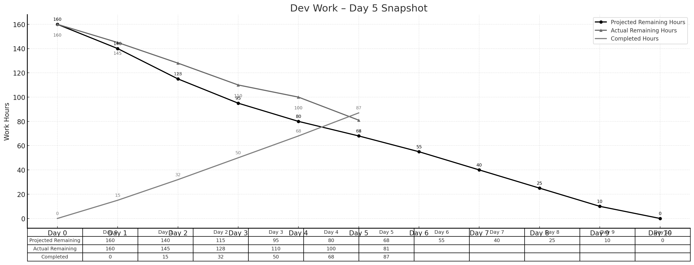

> **项目地址**：[`NewsMind` 项目代码仓库](https://z.gitee.cn/zgca/NewsMind.git)

## 🧭 项目核心信息
- [《团队博客1 - 团队项目核心信息》](/SoftwareEngineering/团队博客1-团队项目核心信息.html)
- [《团队博客2 - 项目Alpha阶段的计划和估计》](/SoftwareEngineering/groupblog2.html)
- [《团队博客3 - Alpha阶段的发布》](/SoftwareEngineering/团队博客3：alpha阶段的发布.html)
- [《团队博客4 - Alpha阶段的 Postmortem 会议》](/SoftwareEngineering/团队博客4：alpha阶段的 postmortem 会议.html)
- [《团队博客5 - Beta阶段的计划与估计》](/SoftwareEngineering/团队博客5.html)

# **Beta Sprint — Day 5 Daily Scrum**

## 📅 **概览**

Day 5 主要集中在偏好设置、检索性能优化、推荐链路的关键节点完善，并在遭遇前两日工时增加的影响下实现了有效追赶。整体节奏稳定，略微缩小与理想进度的差距。

> **今日完成工时：20h**
> **理想剩余：68h**
> **实际剩余：81h**（落后幅度缩小）

累计完成工时：**87h**

---

## 👥 **今日工作概述**

### **姜厚丞（后端） — 6h**

* 解决新闻抓取与反爬问题（BE-15 扩展）
* 引入代理池策略并完成初步稳定验证
* 完成偏好 API（主题偏好 & 新闻源偏好）

### **方羿（前端） — 5h**

* 完成偏好设置页 UI（FE-13 完成）
* 优化表单交互与状态提示
* 将偏好设置结果与后端 API 接入

### **林伟权（AI/搜索） — 5h**

* 完成 LLM QA 模型初版（AI-14 完成）
* 调整 K+V 检索排序逻辑以配合偏好字段
* 为 Day 6 的联调准备简单测试集

### **陈家驹（PM/DevOps） — 4h**

* 完成对话助手整合流程（PM-05）
* 跟踪偏好字段的变更并更新接口文档
* 对已完成模块进行快速冒烟测试

---

## 📌 **任务状态简表**

| 任务 ID | 预计工时 | 已花费 | 剩余 | 状态   |
| ----- | ---- | --- | -- | ---- |
| BE-15 | 8h   | 8h  | 0h | ✔ 完成 |
| FE-13 | 8h   | 8h  | 0h | ✔ 完成 |
| AI-14 | 4h   | 4h  | 0h | ✔ 完成 |
| PM-05 | 4h   | 4h  | 0h | ✔ 完成 |

---

## 🔥 **今日小结**

### 🌟 今日亮点

* 偏好模块（主题 & 新闻源）全链路正式跑通
* 反爬问题得到解决，新闻抓取流程趋于稳定
* 推荐 & QA 模型初步具备基础可用性

### ⚠ 风险 / 注意点

* 抓取模块需持续监控，代理池策略需进一步稳定化
* 明日联调量较大，需所有成员确保接口一致

---

## 📊 **Day 5 燃尽图**

---

## 📈 **燃尽情况**

* **理想剩余：68h**
* **实际剩余：81h**
* **累计完成：87h**

