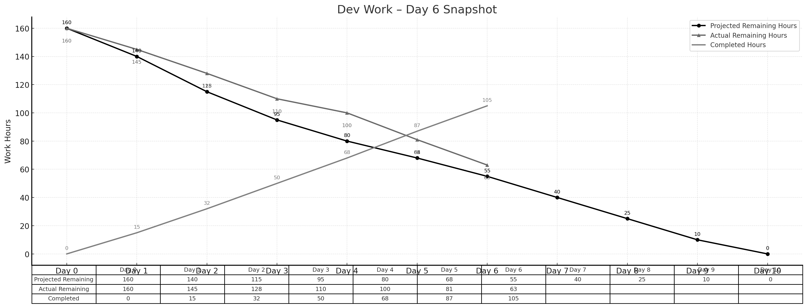

> **项目地址**：[`NewsMind` 项目代码仓库](https://z.gitee.cn/zgca/NewsMind.git)

## 🧭 项目核心信息
- [《团队博客1 - 团队项目核心信息》](/SoftwareEngineering/团队博客1-团队项目核心信息.html)
- [《团队博客2 - 项目Alpha阶段的计划和估计》](/SoftwareEngineering/groupblog2.html)
- [《团队博客3 - Alpha阶段的发布》](/SoftwareEngineering/团队博客3：alpha阶段的发布.html)
- [《团队博客4 - Alpha阶段的 Postmortem 会议》](/SoftwareEngineering/团队博客4：alpha阶段的 postmortem 会议.html)
- [《团队博客5 - Beta阶段的计划与估计》](/SoftwareEngineering/团队博客5.html)

# **Beta Sprint — Day 6 Daily Scrum**

## 📅 **概览**

Day 6 的主要目标是打通 Beta 版本的完整推荐链路：从用户注册 → 偏好设置 → 拉取推荐 → 展示新闻流。团队顺利完成这一核心里程碑，整体进度与理想计划几乎一致。

> **今日完成工时：16h**
> **理想剩余：55h**
> **实际剩余：63h**（进度正常范围）

累计完成工时：**105h**

---

## 👥 **今日工作概述**

### **姜厚丞（后端） — 4h**

* 完成推荐 API v2（K+V 多阶段检索版）开发（BE-16）
* 修复偏好字段映射问题
* 优化推荐响应结构，为前端展示适配

### **方羿（前端） — 4h**

* 完成新版新闻流卡片样式（FE-14）
* 对接推荐 API v2，实现新闻流展示
* 新增加载动画与错误提示

### **林伟权（AI/搜索） — 4h**

* 完成用户画像 v2（AI-16）
* 调整搜索得分与用户偏好的融合方法
* 优化向量检索缓存方案

### **陈家驹（PM/DevOps） — 4h**

* 完成联调组织，全链路 E2E 走查
* 记录发现的问题并同步给功能负责人

---

## 📌 **任务状态简表**

| 任务 ID | 预计工时 | 已花费 | 剩余 | 状态   |
| ----- | ---- | --- | -- | ---- |
| BE-16 | 4h   | 4h  | 0h | ✔ 完成 |
| FE-14 | 4h   | 4h  | 0h | ✔ 完成 |
| AI-16 | 4h   | 4h  | 0h | ✔ 完成 |

---

## 🔥 **今日小结**

### 🌟 今日亮点

* 推荐链路（注册 → 偏好 → 推荐 → 展示）全面打通，是 Beta 阶段最重要的进展之一
* 前端新闻流展示效果显著提升
* 用户偏好与搜索结果的结合更合理

### ⚠ 风险 / 注意点

* 推荐 API 的表现需在 Day 7 进一步做性能验证
* 目前推荐得分权重仍需调优

---

## 📊 **Day 6 燃尽图**

---

## 📈 **燃尽情况**

* **理想剩余：55h**
* **实际剩余：63h**
* **累计完成：105h**
