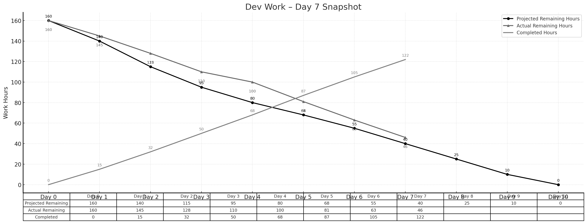

> **项目地址**：[`NewsMind` 项目代码仓库](https://z.gitee.cn/zgca/NewsMind.git)

## 🧭 项目核心信息
- [《团队博客1 - 团队项目核心信息》](/SoftwareEngineering/团队博客1-团队项目核心信息.html)
- [《团队博客2 - 项目Alpha阶段的计划和估计》](/SoftwareEngineering/groupblog2.html)
- [《团队博客3 - Alpha阶段的发布》](/SoftwareEngineering/团队博客3：alpha阶段的发布.html)
- [《团队博客4 - Alpha阶段的 Postmortem 会议》](/SoftwareEngineering/团队博客4：alpha阶段的 postmortem 会议.html)
- [《团队博客5 - Beta阶段的计划与估计》](/SoftwareEngineering/团队博客5.html)

# **Beta Sprint — Day 7 Daily Scrum**

## 📅 **概览**

Day 7 进入 Beta 的体验优化阶段，主要聚焦在 UI Onboarding 流程、用户反馈逻辑、新闻源可信度增强与自动化测试。整体进度继续保持稳定，略微领先理想曲线。

> **今日完成工时：17h**
> **理想剩余：40h**
> **实际剩余：46h**（略微领先）

累计完成工时：**122h**

---

## 👥 **今日工作概述**

### **方羿（前端） — 5h**

* 完成 Onboarding 流程（FE-19）
* 新增首次使用时的引导页面与分步骤提示
* 调整导航栏逻辑以匹配新的用户流程

### **姜厚丞（后端） — 4h**

* 完成用户反馈 API（BE-17）
* 新增点赞 / 不喜欢 / 收藏三类反馈
* 为推荐得分模型提供反馈权重字段

### **林伟权（AI/搜索） — 4h**

* 完成新闻源可信度评分 v2（AI-19）
* 基于历史表现、来源类型、用户反馈提升评分策略
* 为 Day 8 的性能优化做数据准备

### **陈家驹（PM/DevOps） — 4h**

* 更新自动化 E2E 测试（PM-14）
* 新增注册 → 偏好 → 推荐 → 反馈的闭环场景
* 初步统计成功率与失败点

---

## 📌 **任务状态简表**

| 任务 ID | 预计工时 | 已花费 | 剩余 | 状态   |
| ----- | ---- | --- | -- | ---- |
| FE-19 | 4h   | 4h  | 0h | ✔ 完成 |
| BE-17 | 4h   | 4h  | 0h | ✔ 完成 |
| AI-19 | 4h   | 4h  | 0h | ✔ 完成 |
| PM-14 | 4h   | 4h  | 0h | ✔ 完成 |

---

## 🔥 **今日小结**

### 🌟 今日亮点

* Onboarding 流程完成，显著提升新用户首次体验
* 新闻源可信度评分更成熟，有助减少低质量新闻
* 用户反馈闭环（点击 → 推荐调整）首次串联成功

### ⚠ 风险 / 注意点

* 反馈权重对推荐得分影响仍需谨慎调参
* Onboarding 流程尚需在 Day 8 收集用户测试意见

---

## 📊 **Day 7 燃尽图**

---

## 📈 **燃尽情况**

* **理想剩余：40h**
* **实际剩余：46h**
* **累计完成：122h**
