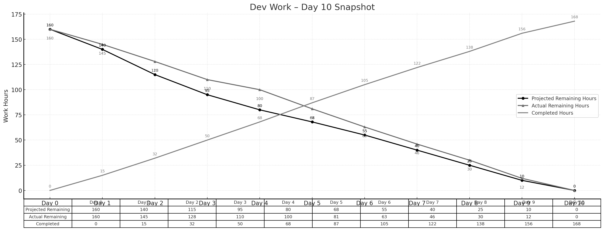

> **项目地址**：[`NewsMind` 项目代码仓库](https://z.gitee.cn/zgca/NewsMind.git)

## 🧭 项目核心信息
- [《团队博客1 - 团队项目核心信息》](/SoftwareEngineering/团队博客1-团队项目核心信息.html)
- [《团队博客2 - 项目Alpha阶段的计划和估计》](/SoftwareEngineering/groupblog2.html)
- [《团队博客3 - Alpha阶段的发布》](/SoftwareEngineering/团队博客3：alpha阶段的发布.html)
- [《团队博客4 - Alpha阶段的 Postmortem 会议》](/SoftwareEngineering/团队博客4：alpha阶段的 postmortem 会议.html)
- [《团队博客5 - Beta阶段的计划与估计》](/SoftwareEngineering/团队博客5.html)

# **Beta Sprint — Day 10 Daily Scrum**

## 📅 **概览**

Day 10 是 Beta Sprint 的最终日，核心工作围绕版本冻结、部署、验收与总结展开。所有功能在今日全部完成并打包部署，团队完成内部测试准备。

> **今日完成工时：14h**
> **理想剩余：0h**
> **实际剩余：0h**（与理想完全一致）

累计完成工时：**168h**

---

## 👥 **今日工作概述**

### **陈家驹（PM/DevOps） — 5h**

* 完成最终部署（PM-06）
* 整合 Beta 版本构建包 + 产物校验
* 跑通 CI/CD 最终发布流程
* 组织短期验收会议 & 完成发布通知

### **姜厚丞（后端） — 3h**

* 进行最后一轮 API 稳定性验证
* 处理部署环境中的 1 个轻微路径问题
* 确认所有数据库迁移脚本正常执行

### **方羿（前端） — 3h**

* 微调组件边距 & 统一视觉规格
* 验证所有移动端适配点位
* 配合 PM 做最终展示准备

### **林伟权（AI/搜索） — 3h**

* 完成一次搜索性能报告（延迟 / 命中率）
* 记录 LLM QA 模式在边界输入场景下的表现
* 提供下阶段（正式版）的优化建议

### **团队 — 共 2h**

* 进行内部回顾会议（Review + Retrospective）

---

## 📌 **任务状态简表**

| 任务 ID | 预计工时 | 已花费 | 剩余 | 状态   |
| ----- | ---- | --- | -- | ---- |
| PM-06 | 4h   | 4h  | 0h | ✔ 完成 |
| FE-20 | 4h   | 4h  | 0h | ✔ 完成 |
| AI-20 | 4h   | 4h  | 0h | ✔ 完成 |

> 所有 Beta 阶段任务全部完成，进入正式发布准备阶段。

---

## 🔥 **今日小结**

### 🌟 今日亮点

* Beta 功能全部实现并成功部署
* 全链路稳定性达标，关键流程全部通过验证

* 搜索、推荐、UI 均达到预期体验水平

### 📌 Sprint 总结要点

* **总工时：168h（含工时调整）完全消耗完毕**
* **关键技术难点（反爬、多阶段检索、偏好系统）全部攻克**
* **系统性能、体验、稳定性全面提升**
* 团队沟通顺畅，整体合作高效

---

## 📊 **Day 10 燃尽图**

---

## 📈 **燃尽情况**

* **理想剩余：0h**
* **实际剩余：0h**
* **累计完成：168h**