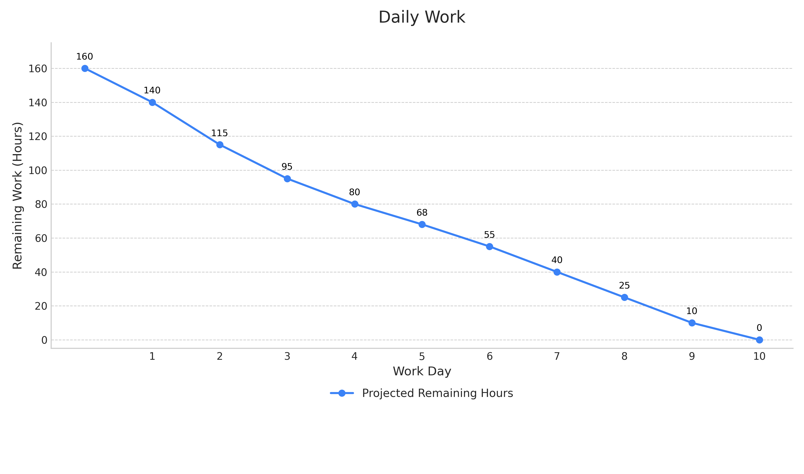

> **项目地址**：[`NewsMind` 项目代码仓库](https://z.gitee.cn/zgca/NewsMind.git)

> 在上一篇博客中，我们介绍了 NewsMind 项目的核心信息。现在，我们将深入探讨 Alpha 阶段的具体执行计划、任务分解和工作量估计。遵循敏捷开发的原则，我们将通过精细化的计划来确保项目在预定周期内顺利推进。

## 1. 工作结构分解

为了实现 Alpha 版本的目标，我们首先将核心功能和典型使用场景分解为具体、可执行的任务，并分配给每位团队成员。我们遵循以下原则：

- **任务拆分**: 每个任务的预计工时（Original Estimated Hour）不超过4小时，以确保任务粒度足够小，易于跟踪和完成。
- **责任明确**: 每个任务都有唯一的负责人。

以下是本次 Alpha Sprint (为期10天) 的 WBS 表格：

| 任务ID             | 功能模块   | 任务描述                                            | 负责人     | 预计工时 (小时)    |
| :----------------- | :--------- | :-------------------------------------------------- | :--------- | :----------------- |
| **后端开发**       |            |                                                     | **姜厚丞** | **(总计: 40小时)** |
| BE-01              | 基础架构   | 初始化后端服务（如 Node.js + Express）和项目结构    | 姜厚丞     | 4                  |
| BE-02              | 数据库     | 设计并初始化用户、新闻、用户偏好等核心数据表结构    | 姜厚丞     | 4                  |
| BE-03              | 用户管理   | 实现用户注册与登录 API 接口                         | 姜厚丞     | 4                  |
| BE-04              | 用户管理   | 实现获取/更新用户画像（偏好）的 API 接口            | 姜厚丞     | 4                  |
| BE-05              | 数据服务   | 开发新闻数据抓取与存储的初步脚本                    | 姜厚丞     | 4                  |
| BE-06              | 数据服务   | 实现新闻数据清洗与格式化模块                        | 姜厚丞     | 4                  |
| BE-07              | 推荐接口   | 开发基础推荐流 API 接口（返回新闻列表）             | 姜厚丞     | 4                  |
| BE-08              | 推荐接口   | 开发用户反馈（点赞/收藏）的 API 接口                | 姜厚丞     | 4                  |
| BE-09              | 对话接口   | 实现与前端对接的 WebSocket 或 HTTP 轮询接口         | 姜厚丞     | 4                  |
| BE-10              | 单元测试   | 编写核心 API 的单元测试用例                         | 姜厚丞     | 4                  |
| **前端开发**       |            |                                                     | **方羿**   | **(总计: 40小时)** |
| FE-01              | 基础架构   | 初始化前端项目（如 Vue/React）并配置路由            | 方羿       | 4                  |
| FE-02              | UI/UX      | 实现应用主页布局及导航栏                            | 方羿       | 4                  |
| FE-03              | UI/UX      | 开发新闻流列表及新闻详情卡片组件                    | 方羿       | 4                  |
| FE-04              | 功能实现   | 实现新闻列表的无限滚动加载功能                      | 方羿       | 4                  |
| FE-05              | 用户模块   | 开发用户登录/注册页面及状态管理                     | 方羿       | 4                  |
| FE-06              | 用户模块   | 开发用户个人偏好设置页面                            | 方羿       | 4                  |
| FE-07              | 交互功能   | 实现新闻卡片的反馈（点赞/收藏）交互逻辑             | 方羿       | 4                  |
| FE-08              | 对话助手   | 开发“对话推荐助手”的基础聊天界面 UI                 | 方羿       | 4                  |
| FE-09              | 接口对接   | 对接后端 API，实现用户登录与新闻数据显示            | 方羿       | 4                  |
| FE-10              | 响应式设计 | 确保核心页面在移动端的初步适配                      | 方羿       | 4                  |
| **AI 算法**        |            |                                                     | **宋尚文** | **(总计: 40小时)** |
| AI-01              | LLM集成    | 封装对大语言模型（如 GPT API）的调用接口            | 宋尚文     | 4                  |
| AI-02              | 语义分析   | 设计并实现新闻内容的语义分类 Prompt                 | 宋尚文     | 4                  |
| AI-03              | 语义分析   | 开发新闻摘要和关键词提取的 Prompt 和调用逻辑        | 宋尚文     | 4                  |
| AI-04              | 数据处理   | 建立新闻数据预处理管道（对接后端数据）              | 宋尚文     | 4                  |
| AI-05              | 用户画像   | 设计基于用户阅读历史和反馈的画像更新初步算法        | 宋尚文     | 4                  |
| AI-06              | 推荐模型   | 实现基于 LLM 生成标签的个性化推荐 v1.0 逻辑         | 宋尚文     | 4                  |
| AI-07              | 对话助手   | 开发识别简单用户意图（如“科技新闻”）的后端逻辑      | 宋尚文     | 4                  |
| AI-08              | 可信度分析 | 设计新闻源可信度评分的初步规则（如来源白名单）      | 宋尚文     | 4                  |
| AI-09              | 模型评估   | 建立评估推荐结果相关性的初步指标和脚本              | 宋尚文     | 4                  |
| AI-10              | 性能优化   | 缓存 LLM 生成结果，减少重复 API 调用                | 宋尚文     | 4                  |
| **项目管理与集成** |            |                                                     | **陈家驹** | **(总计: 40小时)** |
| PM-01              | 项目设置   | 建立 Git 仓库、分支策略和 GitHub Actions CI/CD 流程 | 陈家驹     | 4                  |
| PM-02              | 敏捷管理   | 主持每日站会，更新项目看板（如 GitHub Project）     | 陈家驹     | 4                  |
| PM-03              | 集成测试   | 协调前后端接口联调与测试                            | 陈家驹     | 4                  |
| PM-04              | 集成测试   | 编写端到端（E2E）测试场景，验证核心流程             | 陈家驹     | 4                  |
| PM-05              | 对话助手   | 集成前端 UI、后端接口和 AI 逻辑，打通对话流程       | 陈家驹     | 4                  |
| PM-06              | 部署       | 编写 Alpha 版本的部署脚本并执行初步部署             | 陈家驹     | 4                  |
| PM-07              | 文档       | 撰写核心 API 接口文档                               | 陈家驹     | 4                  |
| PM-08              | RAG研究    | 研究并搭建 RAG 技术的初步验证环境                   | 陈家驹     | 4                  |
| PM-09              | 风险管理   | 跟踪 Pre-mortem 中识别的风险并制定应对措施          | 陈家驹     | 4                  |
| PM-10              | 团队博客   | 负责团队博客的整理与发布                            | 陈家驹     | 4                  |

## 2. Alpha 版本 Sprint 计划

根据敏捷开发的要求，我们对 Alpha 版本的 Sprint 做出如下规划：

- **Sprint 周期**: **10个工作日**。
- **团队人力**: 团队共 **4** 名成员。
- **每日有效工时**: 每位成员每天投入 **4** 小时用于项目开发。
- **总计划工时**: 4人 × 10天 × 4小时/天 = **160 小时**。
- **总体目标**：完成 NewsMind Alpha 版本全部核心功能，包括用户管理、新闻流展示、个性化推荐、以及初步的对话式推荐助手。

为了更好地规划 Sprint 节奏，我们将10天的周期划分为几个阶段，每个阶段有明确的目标和任务重心：

| 天数         | 主要目标                     | 关键任务重心                                                 |
| :----------- | :--------------------------- | :----------------------------------------------------------- |
| **Day 1–2**  | **基础架构搭建与环境配置**   | 完成前后端项目初始化、数据库设计、Git 流程建立和 LLM 接口封装。 (涉及 `*-01`, `*-02` 类任务) |
| **Day 3–5**  | **核心模块开发与数据流打通** | 重点开发用户管理、新闻数据处理、核心推荐逻辑和基础 UI 组件，确保数据能在各模块间初步流动。 (涉及 `*-03` 至 `*-06` 类任务) |
| **Day 6–8**  | **功能集成与端到端流程验证** | 集中进行前后端接口联调，打通从用户交互到推荐结果展示的全链路，实现对话助手核心流程。 (涉及 `*-07` 至 `*-09` 类任务) |
| **Day 9–10** | **系统测试、优化与文档完善** | 进行全面的功能测试和 E2E 测试，修复 Bug，优化性能，完成部署准备，并撰写必要的 API 文档。 (涉及 `*-10` 及 `PM-*` 类任务) |

## 3. 预计燃尽图

