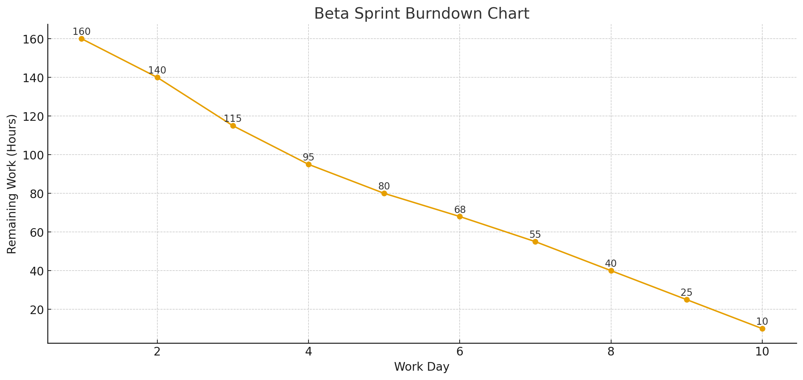

> **项目地址**：[`NewsMind` 项目代码仓库](https://z.gitee.cn/zgca/NewsMind.git)

> 本篇博客基于 NewsMind 项目的 Alpha 复盘与 Postmortem 会议成果，系统总结我们踩过的坑、需要改进的工程能力、以及 Beta 阶段的整体规划。相比 Alpha，这一阶段更强调产品体验、推荐算法的核心价值，以及真正能让典型用户满意的质量与可用性。

---

## 0. 团队成员变动

Beta 阶段团队成员发生如下变化：

- **AI + 搜索算法负责人：宋尚文 → 林伟权**
- 其他成员维持原有角色：
  - 姜厚丞（后端）
  - 方羿（前端）
  - 陈家驹（项目管理、集成与测试）

本次计划已根据团队新构成重新分配任务与风险评估。

---

# 1. Postmortem 复盘：问题、根因、改进

在 Alpha 阶段，我们完成了基本可运行的新闻推荐应用。但在实际开发与测试过程中，也暴露出不少问题。以下为我们在 Postmortem 会议中整理的重点：

---

## 1.1 项目管理方面的问题

### 问题
- 任务估时偏乐观，出现延期
- 前后端接口联调集中在后期完成
- 每日站会信息同步不够及时

### 根因
- 对需求变更准备不足
- 接口规范未提前冻结
- 敏捷看板未做到每日同步

### 改进
- 所有任务必须满足 DoR（Ready）才能开始
- Day 3 前冻结后端 API 草稿
- GitHub Project 自动同步 PR 状态

---

## 1.2 软件工程方面的问题（简化版）

由于 Alpha 阶段经验不足，我们在工程上遇到一些典型难点：

### ① 代码可维护性不足
- 有些模块为了赶进度写得太“快速”，结构不够清晰
- 变量命名、注释、模块边界不统一

### ② 缺少自动质量扫描
- Alpha 阶段虽然配置了 lint，但基本没有真正启用
- 没有静态分析，没有自动检测坏味道

### ③ 缺乏持续测试
- UT（单元测试）覆盖率低
- E2E 测试大部分靠手动跑
- 上版本经常靠“人”发现 Bug

### 简单易懂的 Beta 改进
- 每次提交都要跑 lint（自动修复 + 自动检查）
- 引入简单的自动质量扫描（使用 **Cursor** 辅助发现问题）
- 建立最小可行的 UT + 自动 E2E 测试
- 每天至少保证一次自动构建与自动测试

---

## 1.3 产品体验方面的问题

### 问题
- UI 过于简单，缺少美观和层次感  
- 没有用户注册功能，偏好难以保存  
- 新闻源不支持个性化选择  

### 改进
- UI 全面美化，页面层次与布局优化
- 新增注册/登录/偏好设置功能
- 用户可自定义新闻源

---

# 2. 差距分析：我们是否仍忠于最初新闻稿的愿景？

根据 Alpha 启动时的新闻稿，NewsMind 目标是：

**1）帮助用户从新闻过载中解放出来  
2）让第一次使用就感受到价值，具备快速增长的用户潜力**

以下是我们的差距分析：

---

## 2.1 典型用户的痛点是否被真正解决？

### 结论：Alpha 不够，Beta 必须补强
- 推荐精度不够稳定
- 新闻源不可控，推荐体验一般
- 新用户在第一次使用时看不到足够价值

### Beta 的方向调整
- 强化搜索 + 推荐核心能力  
- 引入 **Key Search + Vector 多阶段检索**  
- 引入 **LLM 超长上下文 辅助检索**，实现更快更准确检索  
- 允许用户自定义新闻源  

---

## 2.2 我们的产品能否“获得很多用户”？

### 问题
- UI 简陋
- 没有注册和初体验流程
- 部署与页面加载速度不够快

### Beta 要解决
- 新 UI 更美观且信息更清晰
- 一键注册、偏好引导、默认推荐
- 更快的接口响应

---

# 3. Beta 阶段重要目标总结

在团队规模和资源有限的情况下，我们将重点聚焦在三大方向：

---

## 目标 1：核心推荐体验升级
- key search + vector search 组合提高速度和相关性  
- 超长上下文LLM辅助快速检索  
- 用户可选择新闻源，增加掌控感  

---

## 目标 2：提升用户体验（UI + Onboarding）
- UI 更好看、有层次  
- 更清晰的导航和卡片样式  

---

## 目标 3：提升软件工程质量（轻量版）
- Cursor 辅助重构代码、生成注释  
- 自动 lint、自动测试  
- 基于 GitHub Action 的每日构建  

---

# 4. Beta 阶段 WBS（工作分解）

Sprint 时长：10 天  
总工时：160 小时（4 人 × 10 天 × 4h）

---

## 4.1 后端（姜厚丞）— 40 小时

| ID | 模块 | 描述 | 工时 |
|---|---|---|---|
| BE-11 | 数据库迁移 | MongoDB → SQLite | 4 |
| BE-12 | 注册/登录完善 | JWT + 加密 | 4 |
| BE-13 | 新闻源管理 | 可配置订阅源 | 4 |
| BE-14 | 抓取优化 | 稳定性与异常恢复 | 4 |
| BE-15 | 偏好 API | 用户新闻偏好接口 | 4 |
| BE-16 | 推荐 API v2 | key + vector 检索整合 | 4 |
| BE-17 | LLM QA API | 提供 QA 模式 | 4 |
| BE-18 | 单测增强 | UT 覆盖核心 API | 4 |
| BE-19 | 文档整理 | REST API 文档更新 | 4 |
| BE-20 | CI 集成 | 自动构建与测试 | 4 |

---

## 4.2 前端（方羿）— 40 小时

| ID | 模块 | 描述 | 工时 |
|---|---|---|---|
| FE-11 | UI 重构 | 更美观的界面和布局 | 4 |
| FE-12 | 注册/登录 | 表单与状态管理 | 4 |
| FE-13 | 偏好设置 | 新闻源 & 标签选择 | 4 |
| FE-14 | 新闻详情 | 样式 + LLM 回答展示 | 4 |
| FE-15 | 对话推荐 UI | 卡片式响应 | 4 |
| FE-16 | 加载动画 | skeleton + 状态提示 | 4 |
| FE-17 | API 对接 | 对接后端新接口 | 4 |
| FE-18 | 响应式优化 | 移动端体验更好 | 4 |
| FE-19 | Onboarding | 初次使用引导 | 4 |
| FE-20 | E2E 测试 | Playwright 测试场景 | 4 |

---

## 4.3 AI + 搜索算法（林伟权）— 40 小时

| ID | 模块 | 描述 | 工时 |
|---|---|---|---|
| AI-11 | Key Search | 关键词倒排索引 | 4 |
| AI-12 | Vector Search | 向量检索优化 | 4 |
| AI-13 | 多阶段检索 | K + V 组合策略 | 4 |
| AI-14 | 辅助检索 | 超长上下文 LLM检索| 4 |
| AI-15 | 摘要 | Prompt + 摘要策略 | 4 |
| AI-16 | 用户画像 v2 | 偏好权重模型 | 4 |
| AI-17 | 日志监控 | 检索命中率分析 | 4 |
| AI-18 | 搜索加速 | 并行化 | 4 |
| AI-19 | 可信度 | 新闻源评分 | 4 |
| AI-20 | 单测 | 算法验证脚本 | 4 |

---

## 4.4 项目管理（陈家驹）— 40 小时

| ID | 模块 | 描述 | 工时 |
|---|---|---|---|
| PM-11 | 敏捷管理 | DoR/DoD 落地 | 4 |
| PM-12 | CI/CD | 自动构建与测试 | 4 |
| PM-13 | 质量扫描 | 基于 Cursor 的代码检查 | 4 |
| PM-14 | E2E 测试 | 测试用例管理 | 4 |
| PM-15 | API 冻结 | Day 3 冻结接口 | 4 |
| PM-16 | 风险管理 | 每日风险矩阵 | 4 |
| PM-17 | 文档管理 | 架构 + 接口文档 | 4 |
| PM-18 | 集成测试 | 每两天集成一次 | 4 |
| PM-19 | mock 采访 | 录制用户反馈视频 | 4 |
| PM-20 | 博客撰写 | 输出文档与内容 | 4 |

---

# 5. Beta Sprint（10 天）

| 天数 | 主要目标 | 内容 |
|---|---|---|
| Day 1–2 | 架构调整 | 数据库迁移 + UI 基础搭建 |
| Day 3–5 | 核心开发 | K+V 检索、QA 模式、偏好设置 |
| Day 6–7 | 联调 | 全链路打通与前后端对接 |
| Day 8–9 | 测试优化 | 自动测试、修 Bug |
| Day 10 | 发布 | mock 采访、准备 Beta 发布 |

---

# 6. 软件工程质量提升方案（简单版）

为了避免 Alpha 的工程“踩坑”，我们在 Beta 阶段会加强工程体系，但保持简单可执行。

## 6.1 使用 Cursor 辅助编码
- 自动补全代码  
- 自动生成注释  
- 自动检查样式与潜在问题（替代复杂工具）  

## 6.2 自动化 CI/CD
- 每次提交自动跑 lint  
- 自动执行单测  
- 自动部署到测试环境  
- 每天至少一次自动构建

## 6.3 代码质量保障（轻量）
- ESLint + Prettier 自动修复格式  
- Cursor 辅助做静态检查  
- 简单 UT（例如 API 的基本输入输出）  
- 基础 E2E（登录、浏览、推荐流程）

---

# 7. mock 用户采访脚本（已完成录制）

我们的 Beta Mock 用户采访视频已经上传，可在 [B站观看](https://b23.tv/jzHhfB6)。
---

# 8. Beta 阶段预计燃尽图

---

# 9. 总结

Beta 阶段对 NewsMind 来说，是从“能用”迈向“好用”的关键阶段。我们将重点提升推荐体验、用户体验与工程质量，确保产品真正解决新闻过载问题，让典型用户在典型场景中感到满意。

---
